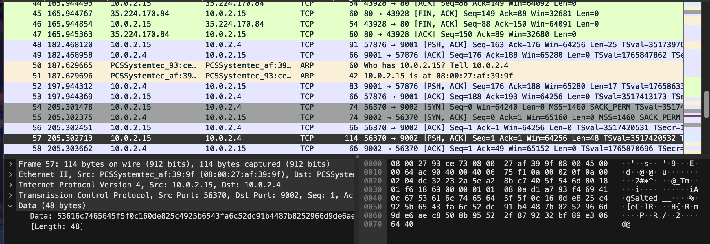

# Eavesdrop

## Problem Statement

> Download this packet capture and find the flag.
[Download packet capture](./capture.flag.pcap)

## Information

**Category**: Forensics

**Difficulty**: Medium

## Hints

1. All we know is that this packet capture includes a chat conversation and a file transfer.

## Solution

using wireshark, we are able to look through the provided [pcap file](./capture.flag.pcap), to start looking through each packet. 

going through each packet and looking at the data, we find the remnants of a conversation between two people, and notably them asking to directions on decrypting a file. the text `*sigh* openssl des3 -d -salt -in file.des3 -out file.txt -k supersecretpassword123`, which is the command we want to run to get out flag! 

however, we don't have the input file, file.des3. Luckily, following the conversation, we find that they resend the file, noted by the data `salted` in the contents of a TCP file following a HTTP connection. 



Exporting the packet bytes through (file > export packet bytes), we get out file `salted_data.bin`, which we are able to use as input for the command we found earlier! Running the command yields us the file.txt, which contains our flag!
```
picoCTF{nc_73115_411_dd54ab67}
```

## Flag

picoCTF{nc_73115_411_dd54ab67}
