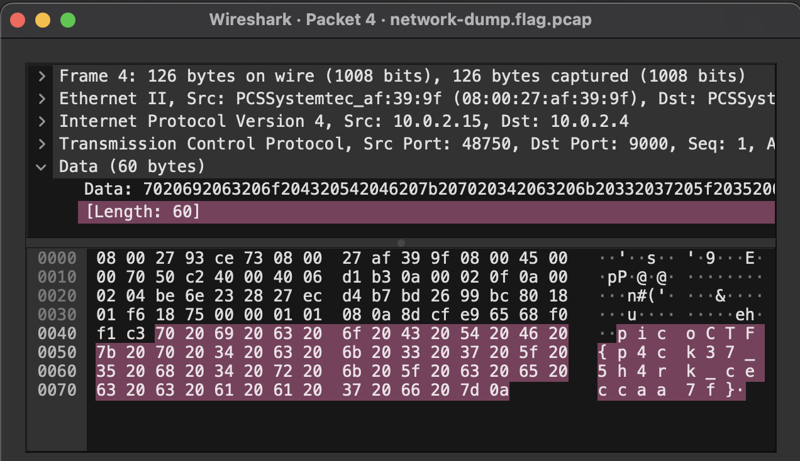

# Packets Primer

## Problem Statement

> Download the packet capture file and use packet analysis software to find the flag.
> [Download packet capture](./network-dump.flag.pcap)

## Information

**Category**: Forensics

**Difficulty**: Medium

## Hints

1. Wireshark, if you can install and use it, is probably the most beginner friendly packet analysis software product.

## Solution

using wireshark, and poking through the data in each of the packets, we are able to find the flag!



```
p i c o C T F { p 4 c k 3 7 _ 5 h 4 r k _ c e c c a a 7 f }
```
is found in the packet dump, which means we have found the flag!

## Flag

picoCTF{p4ck37_5h4rk_ceccaa7f}
