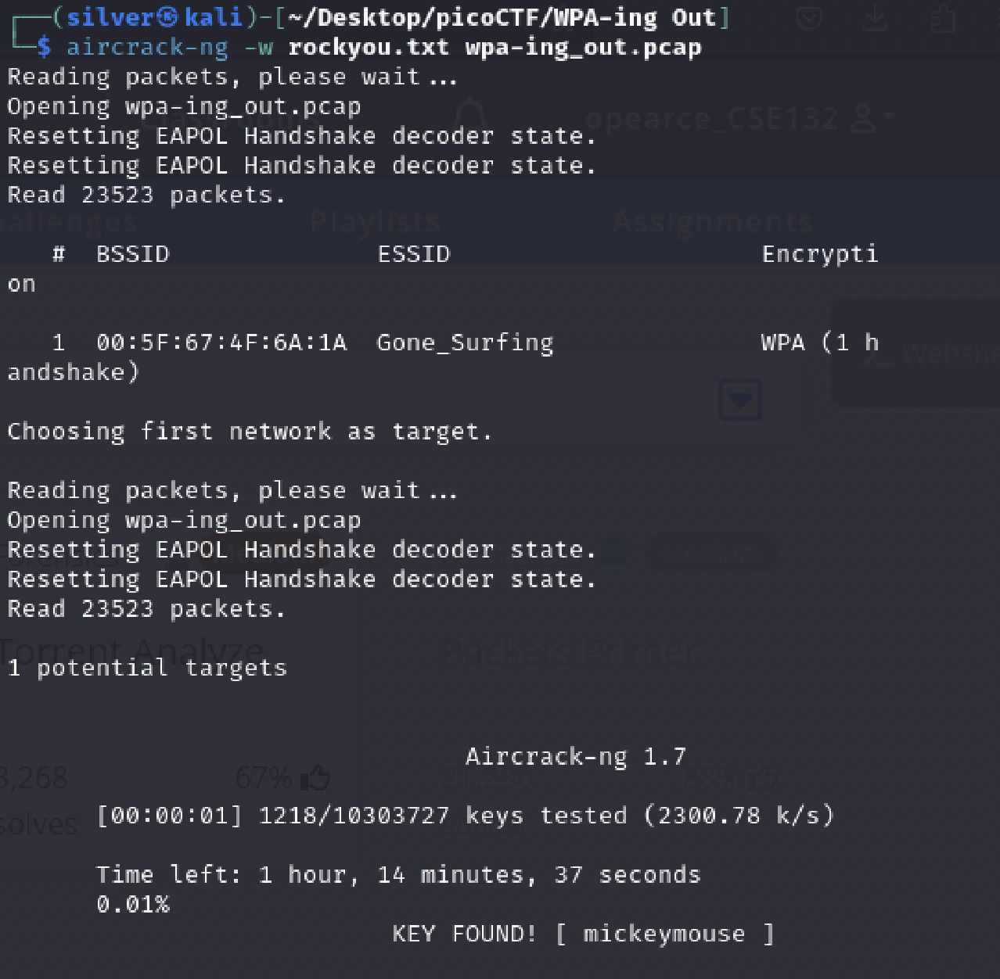

# WPA-ing Out

## Problem Statement

> I thought that my password was super-secret, but it turns out that passwords passed over the AIR can be CRACKED, especially if I used the same wireless network password as one in the [rockyou.txt](./rockyou.txt) credential dump.
> Use this '[pcap file](./wpa-ing_out.pcap)' and the rockyou wordlist. The flag should be entered in the picoCTF{XXXXXX} format.

## Information

**Category**: Forensics

**Difficulty**: Medium

## Hints

1. Finding the IEEE 802.11 wireless protocol used in the wireless traffic packet capture is easier with wireshark, the JAWS of the network.
2. Aircrack-ng can make a pcap file catch big air...and crack a password.

## Solution

Given that the second hint says that we can use aircrack-ng, and learning that it is pre-installed with kali linux, we are able to simply run the command with [rockyou.txt](./rockyou.txt):
```
aircrack-ng -w rockyou.txt wpa-ing_out.pcap
```
which yields this result:

wrapping this in the picoCTF flag format, we get `picoCTF{mickeymouse}` as out flag!

## Flag

picoCTF{mickeymouse}
