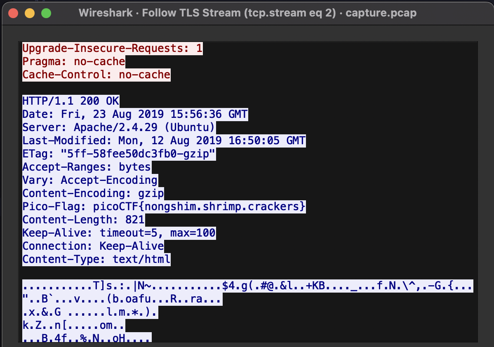

# WebNet0

## Problem Statement

> We found this [packet capture](./capture.pcap) and [key](./picopico.key). Recover the flag.

## Information

**Category**: Forensics

**Difficulty**: Hard

## Hints

1. Try using a tool like Wireshark.
2. How can you decrypt the TLS stream?

## Solution

using wireshark, we are able to look through the provided [pcap file](./torrent.pcap), to which we 
find both TCP and TLS packets! 

following the TCP stream, we find likely encoded data, as it all essentially junk. Looking at hint 2, which asks us how to decrypt the TLS stream, we naturally try and view the TLS stream as well. This yields no results, yet we know they gave us a key which we can likely use to decrypt this stream.

following [this article](https://blog.didierstevens.com/2020/12/14/decrypting-tls-streams-with-wireshark-part-1/), we are able to add the given key and read the contents of the TLS stream, providing us the key!

## Flag

picoCTF{nongshim.shrimp.crackers}
