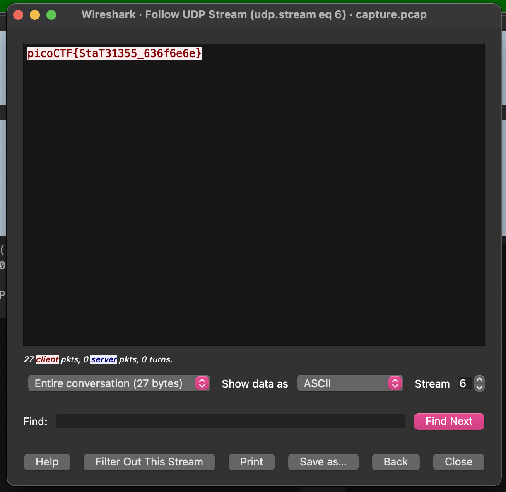

# shark on wire 1

## Problem Statement

> We found this [packet capture](./capture.pcap). Recover the flag.

## Information

**Category**: Forensics

**Difficulty**: Medium

## Hints

1. Try using a tool like Wireshark
2. What are streams?

## Solution

using wireshark, we are able to look through the provided [pcap file](./capture.pcap), to which we look for unusual traffic. Considering hint 2, we imagine that the data is likely sent in a stream, and likely a [udp stream](https://www.wireshark.org/docs/wsug_html_chunked/ChAdvFollowStreamSection.html), which we can follow with wireshark! (packet > follow > UDP Stream)

using the stream selector on the bottom of the window, we can filter through the different streams until we find one that has the flag!

## Flag

picoCTF{StaT31355_636f6e6e}
