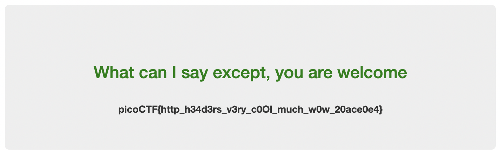

# Who are you? 

## Problem Statement

> Let me in. Let me iiiiiiinnnnnnnnnnnnnnnnnnnn http://mercury.picoctf.net:39114/

## Information

**Category**: Web Exploitation

**Difficulty**: Medium

## Hints

1. It ain't much, but it's an RFC https://tools.ietf.org/html/rfc2616

## Solution

using our browser, we are greeted with website saying: "Only people who use the official PicoBrowser are allowed on this site!" Using software such as [BurpSuite](https://portswigger.net/burp/documentation/desktop/getting-started/intercepting-http-traffic?utm_source=burp_suite_community&utm_medium=learn_tab&utm_campaign=onboarding), we are able to intercept http traffic and modify the headers, to which we modify the [`User-Agent`](https://developer.mozilla.org/en-US/docs/Web/HTTP/Headers/User-Agent) header to say `PicoBrowser`. 

after this, we are greeted with a series of headers that we have to add or modify depending on the webpage that we are greeted with! 

"I don't trust users visiting from another site."
`Referer: mercury.picoctf.net:39114`

"Sorry, this site only worked in 2018"
`Date: Wed, 21 Oct 2018 07:28:00 GMT`

"I don't trust users who can be hacked"
`DNT: 1`

"This website is only for people from sweden"
after googling "swedish ips", I found this one!
`X-Forwarded-For: 102.177.146.0`

"You're in Sweden but you don't speak Swedish?"
`Accept-Language: sv-sv, sv`

this is the whole http request:
```
GET / HTTP/1.1
Host: mercury.picoctf.net:39114
Cache-Control: max-age=0
Accept-Language: sv-sv, sv
Upgrade-Insecure-Requests: 1
User-Agent: PicoBrowser
Accept: text/html,application/xhtml+xml,application/xml;q=0.9,image/avif,image/webp,image/apng,*/*;q=0.8,application/signed-exchange;v=b3;q=0.7
Referer: mercury.picoctf.net:39114
Date: Wed, 21 Oct 2018 07:28:00 GMT
DNT: 1
X-Forwarded-For: 102.177.146.0
Accept-Encoding: gzip, deflate, br
Connection: keep-alive
```

submitting this packet, we finally get the flag!


## Flag

picoCTF{http_h34d3rs_v3ry_c0Ol_much_w0w_20ace0e4}


